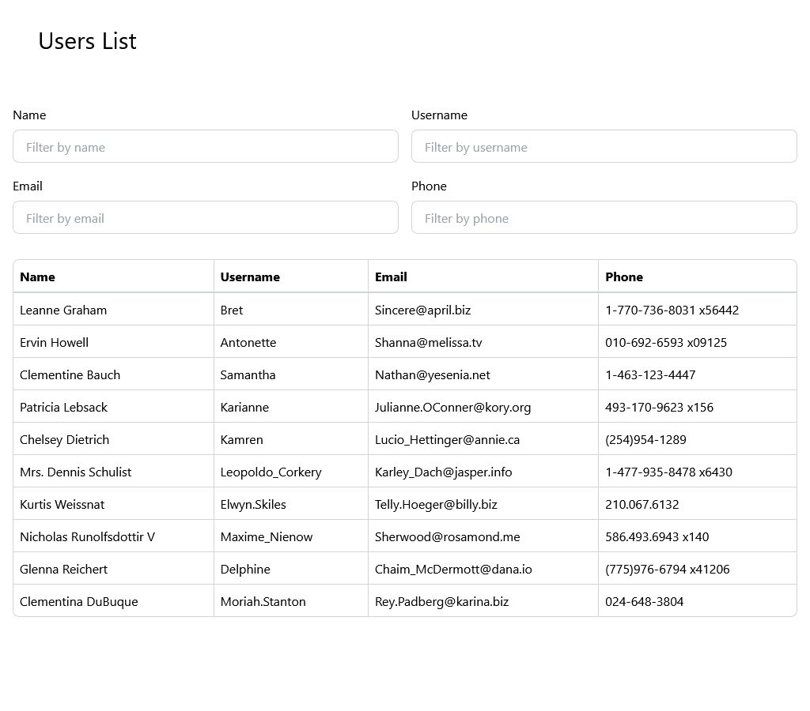

# Smart Redux Toolkit

- [General info](#general-info)
- [Technologies](#technologies)
- [Setup](#setup)
- [Possible improvements](#possible-improvements)

## General info

The application fetches users from jsonplaceholder API and displays basic information about each character. The application allows to filter users by name, username, email and phone.

**[Link to an app - Vercel](https://smart-redux-toolkit.vercel.app/)**



## Technologies

- React
- Redux Toolkit
- TypeScript
- Tailwind (CSS)
- Prettier + Eslint

## Setup

**1. Clone the repo**

```
git clone https://github.com/Pawel-Gnat/smart-redux-toolkit
```

**2. Install NPM packages**

```
npm install
```

**3. Run project**

```
npm run dev
```

## Possible improvements

- Accessibility check
- Provide unit tests
- CI/CD with Github Actions
